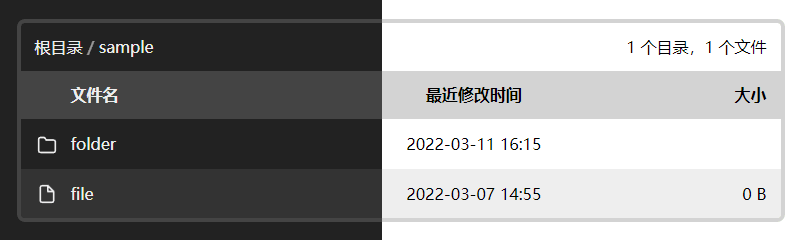

# nginx-simple-index



XSLT template for Nginx AutoIndex Pages

## Usage

```conf
# nginx.conf

load_module modules/ngx_http_xslt_filter_module.so;

server {
  location / {
    root /mnt;

    autoindex on;
    autoindex_format xml;

    xslt_stylesheet /path/to/template.xslt;
    xslt_string_param path $uri;
  }

  # or

  location /abc/ {
    autoindex on;
    autoindex_format xml;

    xslt_stylesheet /path/to/template.xslt;
    xslt_string_param path $uri;
    xslt_string_param root /abc/; # same as location
  }
}
```

## Features

- Dark mode
- BreadCumbs
- i18n support

## i18n support

Parameter lang:

- default: 'en-us'
- enum: ['zh-cn', 'en-us']

You can add more languages on 'template.xslt'.

```conf
# nginx.conf

server {
  location / {
    ...
    xslt_string_param lang 'zh-cn';
  }
}
```

## Todos

- Mobile friendly
- Remove all Javascript
- Symbol link support

## Credits

This work is based upon:

- [dirlist.xslt](https://gist.github.com/wilhelmy/5a59b8eea26974a468c9) by [Moritz Wilhelmy](https://github.com/wilhelmy)
- [abdus/nginx-pretty-index](https://github.com/abdus/nginx-pretty-index)
